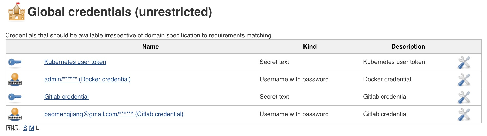
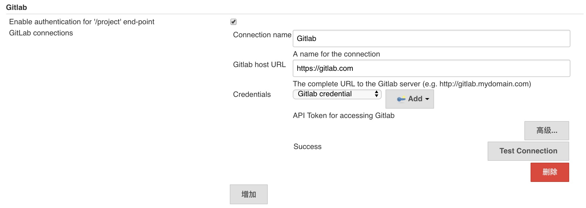
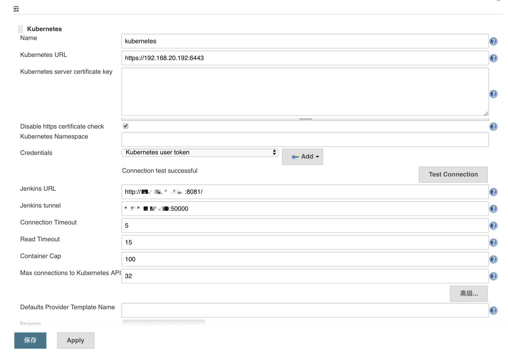
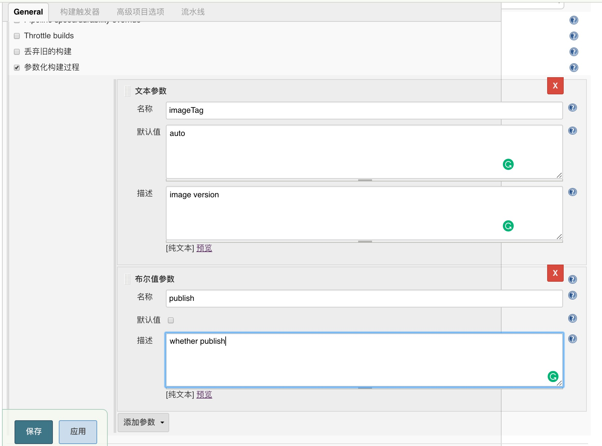
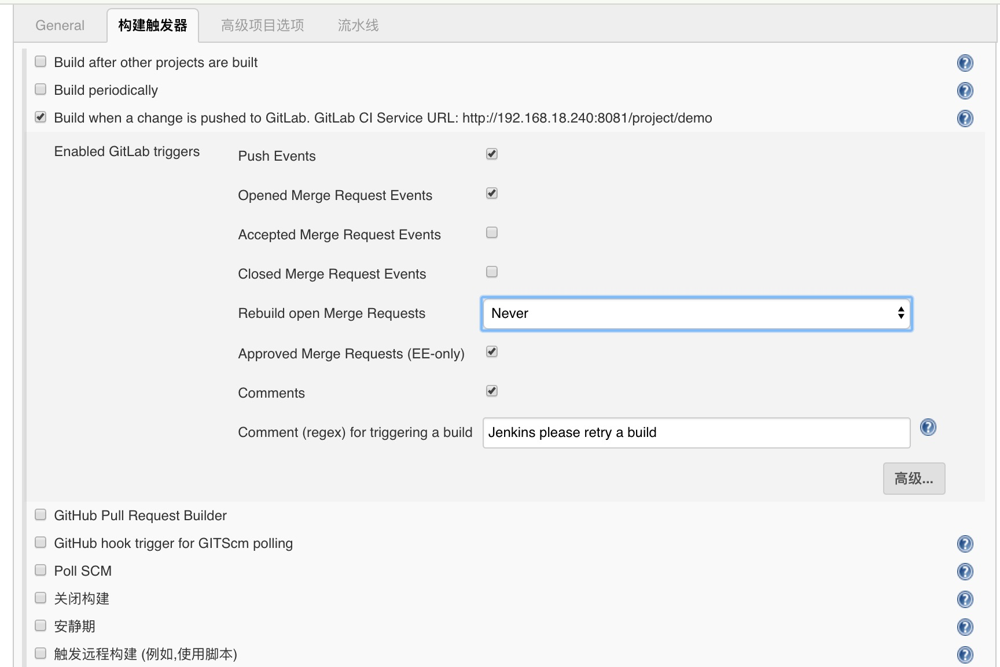
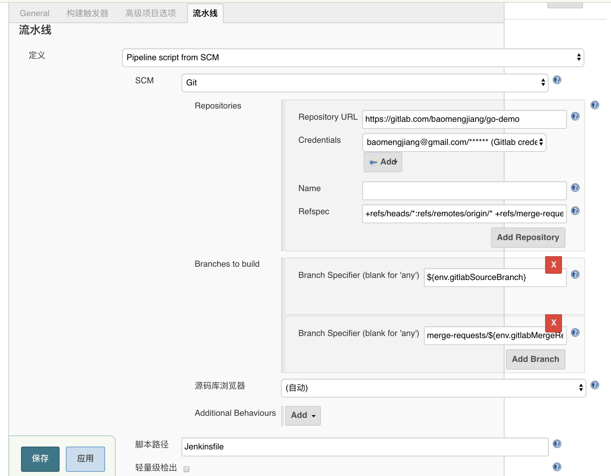
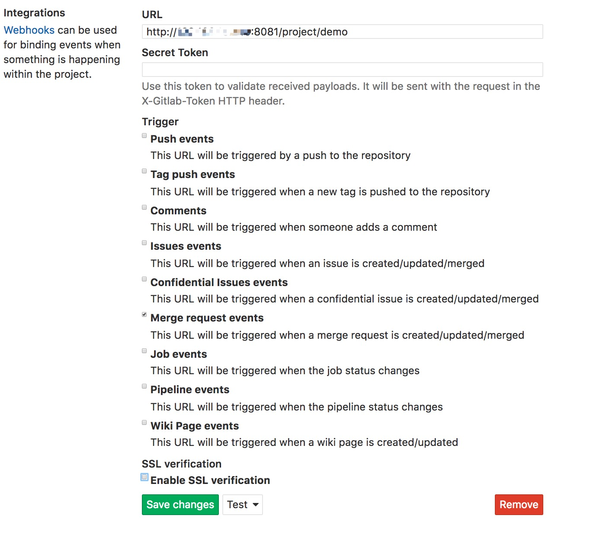

<!-- START doctoc generated TOC please keep comment here to allow auto update -->
<!-- DON'T EDIT THIS SECTION, INSTEAD RE-RUN doctoc TO UPDATE -->
<!-- DON'T EDIT THIS SECTION, INSTEAD RE-RUN doctoc TO UPDATE -->

- [Introduction](#introduction)
- [Guided Tour](#guided-tour)
  - [target](#target)
  - [Prerequisites](#prerequisites)
  - [Build and run Jenkins](#build-and-run-jenkins)
  - [Credentials Configuration](#credentials-configuration)
  - [System Configuration](#system-configuration)
    - [GitLab Plugin Configuration](#gitlab-plugin-configuration)
    - [Kubernetes Cloud Plugin Configuration](#kubernetes-cloud-plugin-configuration)
  - [Jenkins Job Configuration](#jenkins-job-configuration)
    - [Params Configuration](#params-configuration)
    - [Build Trigger Configuration](#build-trigger-configuration)
    - [Pipeline Configuration](#pipeline-configuration)
  - [GitLab Configuration](#gitlab-configuration)
  - [Jenkinsfile Configuration](#jenkinsfile-configuration)
- [References](#references)
  - [Links](#links)

<!-- END doctoc generated TOC please keep comment here to allow auto update -->

# Introduction

This is from [Jenkins Documentation](https://jenkins.io/doc/):

```
Jenkins is a self-contained, open source automation server which can be used to automate all sorts of tasks related to building, testing, and delivering or deploying software.

Jenkins can be installed through native system packages, Docker, or even run standalone by any machine with a Java Runtime Environment (JRE) installed.
```

In the following sections, we'll begin with a Guided Tour to help you set up a Jenkins CI/CD Pipeline with Kubernetes and GitLab.

# Guided Tour

## target

1. Developer open Merge Request
2. GitLab trigger Jenkins CI/CD automatically
3. Jenkins update GitLab statues

## Prerequisites

For this tour, you will require:

- A Kubernetes cluster

- A machine with:

  - 256 MB of RAM, although much more than 512MB is recommended

  - 10 GB of drive space (for Jenkins and your Docker image)

- The following software installed:

  - Docker (navigate to Get Docker at the top of the website to access the Docker download that’s suitable for your platform)

Following we will set up Jenkins on an independent machine, you can also run it in Kubernetes cluster. 

## Build and run Jenkins

- Build docker image by running:
`docker build -t bbbmj/jenkins:2.101-alpine 2.101`

- Run Jenkins by running:
`docker run --restart=always -d --name jenkins -p 8080:8080 -p 50000:50000 -v var/jenkins_home:/var/jenkins_home bbbmj/jenkins:2.101-alpine`
- Browse to `http://localhost:8080`

By using the image we build, the default username and password is `admin`, and plugins we need have been installed, we can just choose none to skip plugin installation. we can refer to [basic-secrity.groovy](/2.101/asic-secrity.groovy) to get more details.

## Credentials Configuration

Browse to `http://localhost:8080/credentials/store/system/domain/_/newCredentials`

In this section, we need to set up three kinds of credentials for authentication:

* GitLab authentication
* Docker host authentication
* Kubernetes authentication

Here is my configuration:

<p align="center"></p>

## System Configuration

Browse to `http://localhost:8080/configure`

### GitLab Plugin Configuration

Here is my configuration:
<p align="center"></p>


### Kubernetes Cloud Plugin Configuration

Here is my configuration:

<p align="center"></p>

Notice, it's better to adjust `Container Cap` according to workload, if set to empty it means no limit.

## Jenkins Job Configuration

Browse to `http://localhost:8080/newJob`

### Params Configuration

<p align="center"></p>

### Build Trigger Configuration

<p align="center"></p>

### Pipeline Configuration

Branches to build should be `${env.gitlabSourceBranch}` and `merge-requests/${env.gitlabMergeRequestIid}/head`

Refspec should be `+refs/heads/*:refs/remotes/origin/* +refs/merge-requests/*/head:refs/remotes/origin/merge-requests/*`

<p align="center"></p>

## GitLab Configuration

Create a new GitLab project or choose an existing one. Then, go to Setting -> Integrations.

<p align="center"></p>

## Jenkinsfile Configuration

Here is a Jenkinsfile Template for golang project:

```
def REGISTRY = "cargo.caicloudprivatetest.com"
def version = "${params.imageTag}"

podTemplate(
    cloud: 'kubernetes',
    namespace: 'default',
    name: 'golang-template',
    // change the label to your component name.
    label: 'golang-template',
    containers: [
        // a Jenkins agent (FKA "slave") using JNLP to establish connection.
        containerTemplate(
            name: 'jnlp',
            // alwaysPullImage: true,
            image: 'cargo.caicloudprivatetest.com/caicloud/jnlp-slave:3.14-1-alpine',
            command: '',
            args: '${computer.jnlpmac} ${computer.name}',
        ),
        // docker in docker
        containerTemplate(
            name: 'dind',
            image: 'cargo.caicloudprivatetest.com/caicloud/docker:17.09-dind',
            ttyEnabled: true,
            command: '',
            args: '--host=unix:///home/jenkins/docker.sock',
            privileged: true,
        ),
        // golang with docker client and tools
        containerTemplate(
            name: 'golang',
            image: 'cargo.caicloudprivatetest.com/caicloud/golang-docker:1.10-17.09',
            ttyEnabled: true,
            command: '',
            args: '',
            envVars: [
                containerEnvVar(key: 'DOCKER_HOST', value: 'unix:///home/jenkins/docker.sock'),
                // Change the environment variable WORKDIR as needed.
                containerEnvVar(key: 'WORKDIR', value: '/go/src/github.com/caicloud/engineering/templates/golang-template'),
                containerEnvVar(key: 'VERSION', value: "${version}"),
                containerEnvVar(key: 'REGISTRIES', value: "${REGISTRY}"+"/caicloud")
            ],
        )
    ],
    volumes: [
        emptyDirVolume(mountPath: '/go'),
    ]
) {
    // Change the node name as the podTemplate label you set.
    node('golang-template') {
        stage('Checkout') {
            checkout scm
        }
        // Change the container name as the container you use for compiling.
        container('golang') {
            ansiColor('xterm') {
                stage("Prepare Project") {
                    sh('''
                        set -e
                        mkdir -p $(dirname ${WORKDIR})
                        rm -rf ${WORKDIR}
                        ln -sfv $(pwd) ${WORKDIR}
                    ''')
                }

                // You can define the stage as you need.
                stage('Unit test') {
                    sh('''
                        set -e
                        cd ${WORKDIR}
                        make test
                    ''')
                }

                stage("Complie") {
                    sh('''
                        set -e
                        cd ${WORKDIR}
                        make build
                    ''')
                }

                stage('Build and push image') {
                    docker.withRegistry("https://${REGISTRY}", "Docker credential") {
                        sh('''
                            cd ${WORKDIR}
                            make container
                        ''')
                        // Whether publish the images is controlled by the params.
                        if (params.publish) {
                            sh('''
                                cd ${WORKDIR}
                                make push
                            ''')
                        }
                    }
               }
           }
       }
   }
}
```

# References

## Links

* https://github.com/jenkinsci/kubernetes-plugin
* https://docs.gitlab.com/
* https://wiki.jenkins.io/display/JENKINS/Git+Plugin
